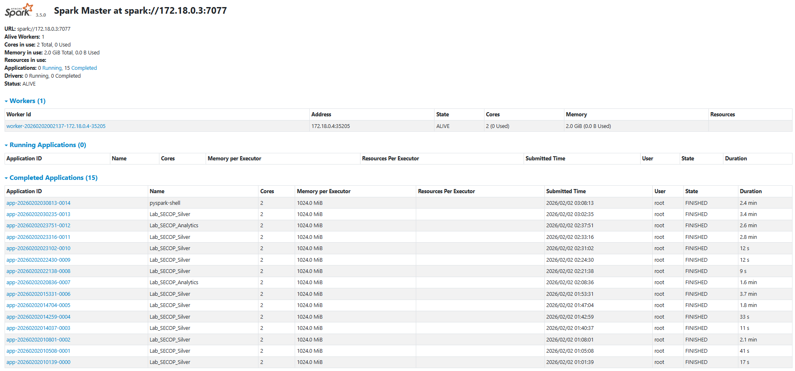

# Taller 3: Spark & Arquitectura Medallion

### **Nombre:** Maria Camila Navarrete
### **Fecha:** 1 de febrero, 2026

## Descripción general

Este laboratorio implementa una arquitectura **Lakehouse** utilizando **Apache Spark** y **Delta Lake**, siguiendo el patrón **Medallion Architecture (Bronze, Silver y Gold)**. El objetivo es procesar información de contratación pública (SECOP), aplicando reglas de calidad de datos, control de errores y analítica de negocio mediante agregaciones.

## Arquitectura Lakehouse

La solución implementa una arquitectura **Medallion** compuesta por tres capas:

- **Bronze**: Ingesta de datos crudos en formato Delta.
- **Silver**: Aplicación de reglas de calidad (Quality Gates) y depuración de datos.
- **Gold**: Agregaciones analíticas orientadas al negocio.

Además, se implementa una **capa de cuarentena** para almacenar registros que no cumplen las reglas de calidad.

## Estructura del repositorio

```text
lab3_spark_lakehouse/
│
├── notebooks/
│   ├── 01_ingest.py
│   ├── 02_transform.py
│   └── 03_analytics.py
│
├── data/
│   └── lakehouse/
│       ├── bronze/
│       ├── silver/
│       ├── gold/
│       └── quarantine/
│
├── docker-compose.yml
└── README.md
```

## Ejecución del laboratorio

1. Levantar el entorno con Docker:

```text
docker-compose up -d
```
2. Ejecutar la ingesta bronze:

```text
spark-submit --master spark://spark-master:7077 notebooks/01_ingest.py
```
3. Ejecutar la transformación y calidad de datos (Silver + Quarantine):

```text
spark-submit --master spark://spark-master:7077 notebooks/02_transform.py
```
4. Ejecutar la analítica gold:

```text
spark-submit --master spark://spark-master:7077 notebooks/03_analytics.py
```

## Descripción por capas

### Bronze 

En esta capa se realiza la ingesta de los datos originales del SECOP, almacenándolos en formato **Delta Lake** sin transformaciones, preservando la información cruda.

### Silver

En la capa Silver se aplican **Quality Gates** para garantizar la calidad de los datos.  
Las reglas implementadas incluyen:

- `precio_base` no nulo
- `precio_base` mayor a cero
- Eliminación de duplicados

Los registros que no cumplen estas reglas se envían a una **tabla de cuarentena**, mientras que los registros válidos se almacenan en la capa Silver.

### Gold

En la capa Gold se realizan agregaciones analíticas orientadas al negocio.

Se calcula el **Top 10 de departamentos con mayor valor total contratado**, utilizando la suma del campo `precio_base`.

## Resultados

El resultado de la capa Gold muestra los departamentos con mayor volumen de contratación pública, permitiendo un análisis agregado del gasto por región.

Top 3:

| Departamento | Total Contratado |
|--------------|------------------|
| VALLE        |     394161052301 |
| BOLIVAR      |     386120570040 |
| ATLANTICO    |     384507061234 |

**Arquitectura del sistema**

El siguiente pantallazo muestra el spark master ejecutándose dentro del entorno docker.




## Conclusiones

Este laboratorio demuestra la implementación de una arquitectura Lakehouse usando Spark y Delta Lake, integrando control de calidad, manejo de errores y analítica de datos de forma escalable y reproducible.
